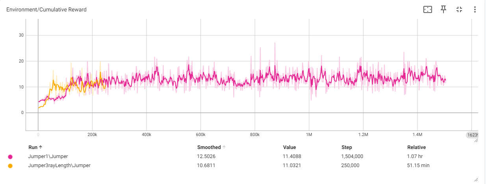
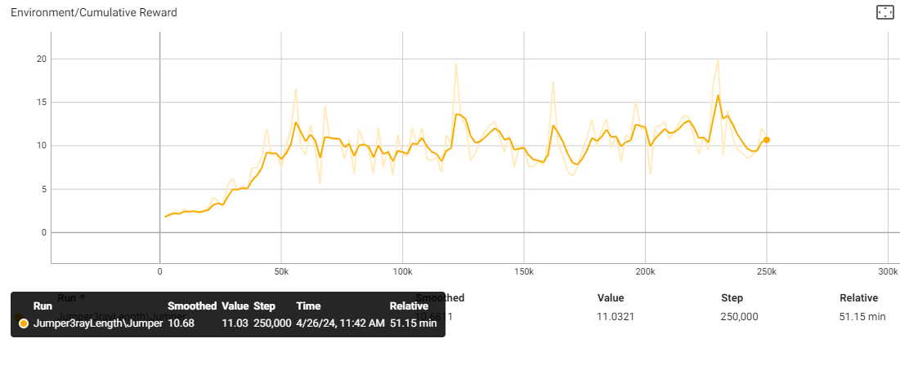

<pre>
███╗   ███╗██╗              ██╗██╗   ██╗███╗   ███╗██████╗ ███████╗██████╗ 
████╗ ████║██║              ██║██║   ██║████╗ ████║██╔══██╗██╔════╝██╔══██╗
██╔████╔██║██║              ██║██║   ██║██╔████╔██║██████╔╝█████╗  ██████╔╝
██║╚██╔╝██║██║         ██   ██║██║   ██║██║╚██╔╝██║██╔═══╝ ██╔══╝  ██╔══██╗
██║ ╚═╝ ██║███████╗    ╚█████╔╝╚██████╔╝██║ ╚═╝ ██║██║     ███████╗██║  ██║
╚═╝     ╚═╝╚══════╝     ╚════╝  ╚═════╝ ╚═╝     ╚═╝╚═╝     ╚══════╝╚═╝  ╚═╝
------------------------------------------------------------------------------------------------------------------------
ML Jumper project for AP VR experience 23-24:
Simple 3d game where a ml agent learns how to jump over objects
</pre>
<h2>Lander Van der Stighelen & Vinnie Post</h2>

## Prerequisites

- [Unity](https://unity.com/)
- [Python 3.9.19](https://www.python.org/downloads/release/python-3919/)
- [torch 1.7.1+cu110](https://pytorch.org/get-started/previous-versions/)
- [ML Agents 0.30.0](https://pypi.org/project/mlagents/0.30.0/)

## Set-up
A jumping task where the agent must jump over logs.
## Goal: 
Jump over as many logs as possible
## Agents: 
The environment contains one agent.

## Agent Reward Function:
* -0.05 at each jump
* reward = -1 when hitting a log
* +0.5 for clearing a log (when log is deleted)
* +0.01 for every frame when not jumping

## Behavior Parameters:
* Vector Observation space: 
* * One variable corresponding to current state.
* Actions: 
* * 2 discrete action branch with 1 actions (Jump).
* Visual Observations: RayCast
    Float Properties: None

## Benchmark Mean Reward: 
11.12 +- 0.44

## Code setup:
All the code for the Jumper scene is located in the Jumper folder under Assets.

#### Jumer Script
The Jumper script is attached to the agent itself and controls the Targets and Agent. At random time intervals, a Target object is spawned at the location of the empty spawnet object, so the Agent has a continous stream of objects to jump over. This is andeled in the Update() method. 

When a Target is initialized, the Jumper object is passed to the Target, so the agent can be rewarded when the target collides with the wall.

An episode is ended only when the Agent collides with a Target. Not when a Target collides with the wall. When an episode is ended, the position of the agent resets and all Target instances get destroyed. The boolean isGrouned is manually set to true, because of a bug where the collision with the ground sometimes went undetected. (I spend a lot of time debugging this)

The script has 1 sensor observation (apart from the rays) to let the agent know if it is grounded or not.

I also added a boolean jumpRequested that gets checked in the Update() method for the heuristic mode, because the spacebar was very unresponsive in heuristic mode. I think this was an issue caused by frametimes and discrete actions. 

#### Mover Script
The mover script is attached to the Target prefab and maket it move. In the Start() method, the target is initialised with a random speed. 

The script also checks for collisions with the wall and calls the reward function of Jumper script on collision.

## Experience training:
Once all the bugs were removed (which took a long time), the training proceeded smoothly. I trained 2 times. One time for 1500000 steps and one time for 25000 steps. During training, I put the wall closer to the agent than in the video, so the agent is faster rewarded on a good action.

Both were trained in parallel with 10 training environments. The only change I made in the second training (yellow line) was the ray length, which made the model learn a lot faster at the beginning. This makes sense, because the ray lengt was tuned so the agent should jumpt the moment the object comes into the range of the ray. But for both, the agent did not improve after around 100000 steps. This also makes sense, because the agent only has to learn one action. 
